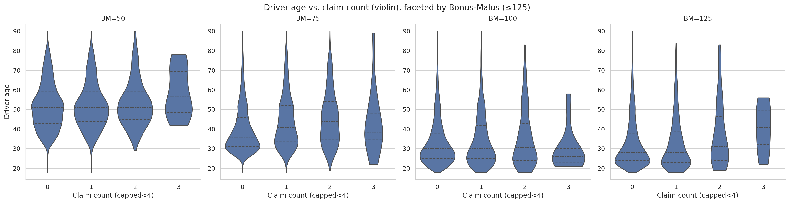

# freMTPL2 – Frequenz-EDA (Counts)

**Ziel:** Verständlicher Überblick über Schadenfrequenzen in Motor (Counts) als Vorbereitung für ein Pricing-Modell.  
**Kurzfazit:**
- Deutliche Unterschiede nach **Marke × Antrieb**; **B12** sticht heraus (Neuwagen-Effekt).
- Über das **Fahrzeugalter** sinkt die Frequenz meist; bei **BM=125** zeigt sich um ~10–12 Jahre ein kleiner Buckel.
- **Fahreralter** wirkt **U-förmig**, besonders in **BM=125**; Verteilungen bestätigen das Bild.

---

## Methodischer Rahmen 

- **Zielgröße:** Schaden-**Counts**; **Exposure** geht später als **Offset** in ein Poisson-GLM  
  $$\log \mathbb{E}[\text{ClaimNb} \mid X] = \log(\text{Exposure}) + \eta(X)$$
  

  - **Frequenz je Gruppe:** $\hat{\lambda}=\frac{\sum \text{ClaimNb}}{\sum \text{Exposure}}$ (exposure-gewichtet).  
  Kleine, laute Gruppen werden gefiltert: nur Zellen mit **≥ 100 Policy-Jahren**.
- **Datenbereinigung (nach Schelldorfer & Wüthrich, 2019):**  
  `ClaimNb ≤ 4`, `Exposure ≤ 1`, `DrivAge ≤ 90`, `VehAge ≤ 40`.  
  **Filter für Interaktionen:** `BonusMalus ≤ 125`; **B12-Neuwagen** (VehAge=0) ausgeschlossen.
- **Unsicherheit:** Konfidenzbänder via Poisson-Approximation; breite Bänder = wenig Exposure.

---

## Kernbefunde & Grafiken

### A) Brand × Fuel

- **Beobachtung:** Marke **B12** mit sehr hoher Frequenz, vorallem bei **Regular**.  
- **Konsequenz:** B12-Neuwagen in Interaktionsplots ausgeschlossen, um Neuwagen-Sondereffekte zu vermeiden.

---

### B) Vehicle age × Bonus-Malus (BM ≤ 125, B12-Neuwagen excl.)

- **Beobachtung:** Frequenz **nimmt i. d. R. mit Fahrzeugalter ab**.  
- **Detail:** In **BM=125** leichter **Anstieg** um ~10–12 Jahre.  
- **Hinweis:** Ränder haben weniger Exposure → **breitere Bänder**.

---

### C) Driver age × Bonus-Malus (BM ≤ 125; 5-Jahres-Bins, 85=85+)

- **Beobachtung:** **U-förmiges** Muster über das Fahreralter, am stärksten bei **BM=125**.  
- **Interpretation:** Jüngere und sehr alte Fahrer haben höhere Frequenzen; mittlere Altersgruppen liegen niedriger.

---

### D) Violin – Driver age ~ Claim count, facettiert nach BM (≤125)

- **Beobachtung:** Verteilungen verschieben sich mit **ClaimNb**; Facets zeigen **Interaktionen** mit BM.  
- **Hinweis:** Violin ist **deskriptiv** (ungewichtet); Entscheidungen stützen wir auf die exposure-gewichteten Auswertungen oben.

---
<!--
## Implikationen für die Modellierung

- **Baseline:** Poisson-GLM für **Counts** mit **log(Exposure) als Offset**.  
- **Form der Effekte:**
  - **Fahreralter:** nahe **monoton/U-förmig** → **Splines (GAM)** oder **monotone Constraints** im Boosting plausibel.
  - **Fahrzeugalter:** meist fallend → einfache Terme möglich; Splines prüfen.
  - **BM-Interaktionen:** sichtbar → ausgewählte Interaktionen modellieren bzw. additive Modelle mit Interaktionstermen nutzen.
- **Kategorische Features:** Low/Mid-Card → **One-Hot** (ggf. „Other“ für seltene Klassen); High-Card → **Target-Encoding out-of-fold** (Leckage vermeiden).

---

## Was wir **nicht** tun

- Keine Rohdaten im Repo; keine personenbezogenen Aussagen.  
- Keine regulatorischen Claims (IFRS/SII).  
- Keine Ziel-Leckage (Encodings später strikt **OOF**).

---

## Nächster Schritt

**Poisson-GLM (Baseline)** mit **Kalibrierungs-Plot** (Reliability) und **Lift/Gini** (OOF). Danach Vergleich mit **GAM** (Splines) und **Boosting** (Poisson/Tweedie); optional **EBM** oder **monotone LightGBM**.
-->
